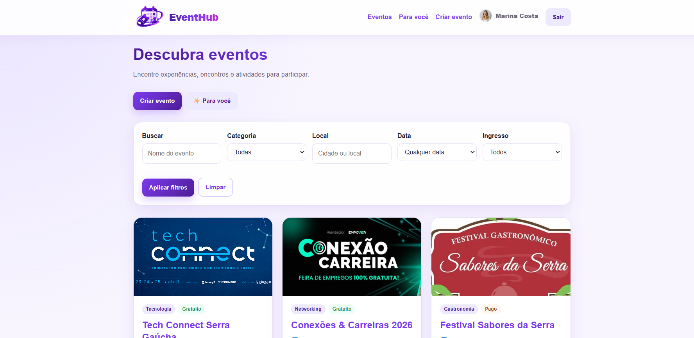
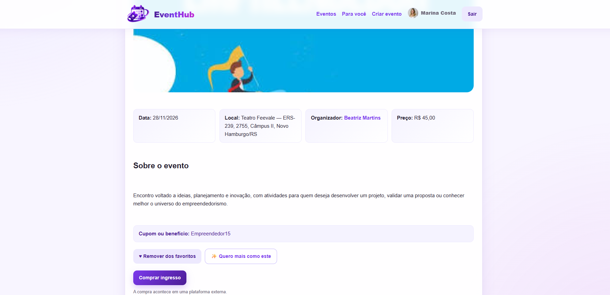
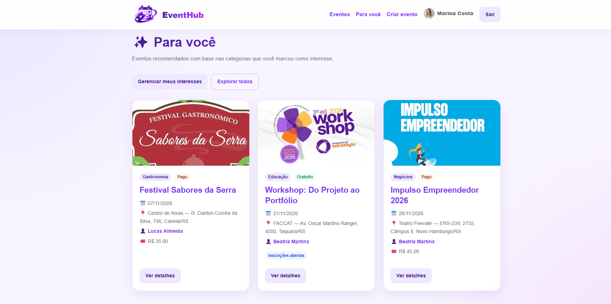

# 🎟️ EventHub

O **EventHub** é uma plataforma web para **descobrir, divulgar e participar de eventos**, conectando participantes e organizadores em um único ambiente.

Desenvolvido com **Node.js, Express, EJS e MySQL**, o projeto utiliza a arquitetura **MVC (Model-View-Controller)** para separar as responsabilidades da aplicação e facilitar sua organização e manutenção.

No EventHub, uma única conta pode participar de eventos e também publicar seus próprios eventos. Ao criar um evento, o usuário passa a ser o organizador daquela publicação, sem a necessidade de escolher previamente entre contas de participante ou organizador.

O projeto foi desenvolvido em uma **atividade voltada à construção de portfólio**, com o objetivo de aplicar na prática conceitos de desenvolvimento web, arquitetura MVC, autenticação, banco de dados, validação, upload de arquivos e deploy.

---

## 📸 Demonstração

### Explorar eventos

A página principal permite descobrir eventos e utilizar filtros por categoria, localização, período e tipo de ingresso.



### Detalhes de um evento

Cada evento possui uma página própria com suas principais informações. Em eventos pagos, também podem ser apresentados preço, cupom ou benefício, quantidade de vagas vinculadas ao benefício e direcionamento para a plataforma externa responsável pela venda dos ingressos.



### Perfil

Os usuários podem personalizar seus perfis com foto, biografia e localização, além de visualizar os eventos que organizam.


### Recomendações personalizadas

A área **"Para você"** utiliza os interesses registrados pelo usuário para apresentar eventos relacionados às categorias de que ele gosta.



> Os perfis e eventos apresentados nas imagens são dados fictícios criados exclusivamente para demonstração do projeto.

---

## ✨ Funcionalidades

### 👤 Contas e perfis

- Cadastro de usuários
- Login e logout
- Autenticação baseada em sessão
- Senhas protegidas com hash utilizando bcrypt
- Recuperação e redefinição segura de senha no ambiente local
- Perfil pessoal editável
- Perfil público
- Foto ou logo de perfil
- Upload de imagem pelo dispositivo ou uso de URL
- Biografia
- Cidade ou região
- Links opcionais para site e Instagram
- Visualização dos eventos organizados pelo usuário

### 📅 Eventos

- Criação de eventos
- Edição dos próprios eventos
- Exclusão dos próprios eventos
- Página de detalhes de cada evento
- Organização por categorias
- Imagem de capa por upload ou URL
- Definição de data e local
- Eventos gratuitos e pagos
- Limite de vagas para eventos gratuitos
- Preço para eventos pagos
- Link externo para compra de ingressos
- Cupom ou benefício opcional para eventos pagos
- Definição da quantidade de vagas disponibilizadas com o cupom ou benefício
- Validação das informações cadastradas
- Bloqueio de criação de eventos com datas passadas

### 🎫 Inscrições e ingressos

Nos eventos gratuitos, a inscrição é realizada diretamente pelo EventHub. Nos eventos pagos, a compra do ingresso permanece sob responsabilidade da plataforma externa indicada pelo organizador.

- Inscrição em eventos gratuitos
- Prevenção de inscrições duplicadas
- Bloqueio de inscrição no próprio evento
- Controle das vagas restantes em eventos gratuitos
- Visualização das próprias inscrições
- Cancelamento de inscrições
- Separação entre eventos futuros e histórico
- Direcionamento para plataforma externa em eventos pagos
- Divulgação de cupom ou benefício para eventos pagos
- Informação da quantidade de vagas disponibilizadas com o cupom ou benefício

> Nos eventos pagos, as vagas informadas no EventHub são referentes ao **cupom ou benefício disponibilizado pelo organizador**. Elas não representam a capacidade total do evento nem a quantidade de ingressos disponíveis na plataforma externa.

### 🔎 Exploração

- Pesquisa de eventos
- Filtro por categoria
- Filtro por localização
- Filtro por período
- Filtro entre eventos gratuitos e pagos
- Exibição de eventos futuros disponíveis

### ❤️ Favoritos e interesses

- Adição e remoção de eventos favoritos
- Área de eventos favoritados
- Recurso **"Quero mais como este"**
- Registro das categorias de interesse do usuário
- Área para visualização e gerenciamento dos interesses

### ✨ Recomendações personalizadas

A área **"Para você"** utiliza as categorias de interesse do usuário para recomendar eventos relacionados às suas preferências.

As recomendações consideram eventos futuros pertencentes às categorias de interesse e excluem eventos organizados pelo próprio usuário.

---

## 🛠️ Tecnologias utilizadas

- **Node.js** — ambiente de execução JavaScript
- **Express** — servidor web e gerenciamento de rotas
- **EJS** — renderização das páginas
- **MySQL** — banco de dados relacional
- **mysql2** — integração entre Node.js e MySQL
- **bcryptjs** — hash de senhas
- **express-session** — gerenciamento de sessões
- **express-mysql-session** — persistência das sessões no MySQL
- **express-validator** — validação dos dados recebidos
- **Multer** — processamento dos uploads de imagens
- **Cloudinary** — armazenamento das imagens de perfis e eventos
- **Nodemailer** — envio de e-mails para recuperação de senha no ambiente local
- **dotenv** — gerenciamento das variáveis de ambiente
- **HTML5** — estrutura das páginas
- **CSS3** — estilização e responsividade
- **JavaScript** — interações no frontend

---

## 🏗️ Estrutura do projeto

O EventHub segue a arquitetura **MVC (Model-View-Controller)**, mantendo separadas as responsabilidades relacionadas aos dados, controle das requisições e interface.

```text
eventhub-mvc/
│
├── config/
│   └── database.js
│
├── controllers/
│   ├── authController.js
│   ├── eventoController.js
│   ├── favoritoController.js
│   ├── inscricaoController.js
│   ├── interesseController.js
│   └── usuarioController.js
│
├── database/
│   ├── schema.sql
│   └── seed.sql
│
├── docs/
│   └── screenshots/
│       ├── detalhes-evento.png
│       ├── explorar-eventos.png
│       ├── para-voce.png
│       └── perfil.png
│
├── middlewares/
│   ├── authMiddleware.js
│   └── validationMiddleware.js
│
├── models/
│   ├── Categoria.js
│   ├── Evento.js
│   ├── Favorito.js
│   ├── Inscricao.js
│   ├── Interesse.js
│   └── Usuario.js
│
├── public/
│   ├── css/
│   │   └── style.css
│   ├── imagens/
│   │   └── logo.png
│   └── js/
│       └── main.js
│
├── routes/
│   ├── authRoutes.js
│   ├── eventoRoutes.js
│   ├── favoritoRoutes.js
│   ├── inscricaoRoutes.js
│   ├── interesseRoutes.js
│   └── usuarioRoutes.js
│
├── views/
│   ├── auth/
│   │   ├── cadastro.ejs
│   │   ├── esqueci-senha.ejs
│   │   ├── login.ejs
│   │   └── redefinir-senha.ejs
│   │
│   ├── eventos/
│   │   ├── criar.ejs
│   │   ├── detalhes.ejs
│   │   ├── editar.ejs
│   │   ├── index.ejs
│   │   ├── meus-eventos.ejs
│   │   └── para-voce.ejs
│   │
│   ├── favoritos/
│   │   └── index.ejs
│   │
│   ├── interesses/
│   │   └── index.ejs
│   │
│   ├── partials/
│   │   ├── evento-card.ejs
│   │   ├── footer.ejs
│   │   └── header.ejs
│   │
│   ├── perfil/
│   │   ├── editar.ejs
│   │   ├── meu-perfil.ejs
│   │   └── publico.ejs
│   │
│   ├── 404.ejs
│   ├── erro.ejs
│   └── minhas-inscricoes.ejs
│
├── .env.example
├── .gitignore
├── app.js
├── package-lock.json
├── package.json
└── README.md
```

### Organização

- **Models:** comunicação com o banco de dados
- **Views:** interface renderizada com EJS
- **Controllers:** controle das requisições e regras da aplicação
- **Routes:** definição dos endpoints
- **Middlewares:** autenticação e validação
- **Config:** configuração da conexão com o banco
- **Database:** scripts de criação e dados iniciais
- **Public:** CSS, JavaScript e imagens utilizadas pela aplicação
- **Docs:** imagens utilizadas na documentação do projeto

---

## 🗄️ Banco de dados

O EventHub utiliza **MySQL** para persistência dos dados.

As principais entidades da aplicação são:

- Usuários
- Eventos
- Categorias
- Inscrições
- Favoritos
- Interesses

Entre as principais relações e regras implementadas:

- Um usuário pode organizar vários eventos
- Cada evento possui um usuário organizador
- Cada evento pertence a uma categoria
- Um usuário pode se inscrever em diferentes eventos
- Uma mesma inscrição não pode ser realizada duas vezes para o mesmo evento
- Um usuário não pode se inscrever no próprio evento
- Usuários podem favoritar diferentes eventos
- Usuários podem registrar diferentes categorias de interesse

A configuração da conexão é realizada por variáveis de ambiente, permitindo utilizar uma instância MySQL local durante o desenvolvimento ou um serviço MySQL externo em produção sem alterar a lógica da aplicação.

---

## 🚀 Como executar

### 1. Clone o repositório

```bash
git clone https://github.com/ariannedemattos-aam/eventhub-mvc.git
```

Acesse a pasta:

```bash
cd eventhub-mvc
```

### 2. Instale as dependências

```bash
npm install
```

### 3. Configure as variáveis de ambiente

Crie um arquivo `.env` na raiz do projeto utilizando o `.env.example` como referência.

```env
PORT=3000

DB_HOST=localhost
DB_PORT=3306
DB_USER=root
DB_PASSWORD=sua_senha
DB_NAME=eventhub

SESSION_SECRET=troque_por_uma_chave_secreta_forte

NODE_ENV=development

CLOUDINARY_CLOUD_NAME=seu_cloud_name
CLOUDINARY_API_KEY=sua_api_key
CLOUDINARY_API_SECRET=seu_api_secret

EMAIL_USER=seu_email@gmail.com
EMAIL_APP_PASSWORD=sua_senha_de_app
APP_URL=http://localhost:3000
```

> O arquivo `.env` contém informações sensíveis e não deve ser enviado ao repositório.

### 4. Configure o banco de dados

Os scripts SQL estão disponíveis em:

```text
database/
├── schema.sql
└── seed.sql
```

Para criar uma nova estrutura do banco, execute o `schema.sql`.

O `seed.sql` pode ser utilizado para inserir os dados iniciais necessários à aplicação.

> **Atenção:** o `schema.sql` é destinado à criação de uma nova estrutura e pode remover estruturas existentes. Não o execute sobre um banco com dados que precisam ser preservados.

### 5. Inicie a aplicação

```bash
npm start
```

Por padrão, a aplicação estará disponível em:

```text
http://localhost:3000
```

---

## 🔐 Segurança e validação

Entre as medidas implementadas na aplicação estão:

- Hash de senhas com bcrypt
- Autenticação baseada em sessão
- Persistência das sessões no MySQL
- Cookies de sessão `httpOnly`
- Cookies seguros no ambiente de produção
- Validação dos dados recebidos pelo backend
- Controle de autorização para edição e exclusão de eventos
- Proteção das operações vinculadas ao usuário autenticado
- Prevenção de inscrições duplicadas
- Variáveis sensíveis mantidas fora do código-fonte
- Configuração SSL para conexão com o banco em produção
- Validação de formato e limite de tamanho dos uploads
- Recuperação de senha com token aleatório de uso temporário
- Armazenamento apenas do hash do token de recuperação no banco
- Expiração e invalidação do token após a redefinição da senha
- Resposta genérica na solicitação de recuperação para evitar exposição da existência de contas

Os uploads de perfil e capa de eventos aceitam imagens **JPG, PNG e WEBP de até 5 MB**.

### Recuperação de senha

O fluxo de recuperação de senha foi implementado e validado no **ambiente local**, utilizando envio de e-mail e links temporários para redefinição da senha.

Na versão hospedada no plano gratuito do **Render**, essa funcionalidade permanece **desabilitada em produção** devido às restrições do ambiente utilizado para conexões SMTP externas.

Por esse motivo, o link **"Esqueceu sua senha?"** não é exibido em produção e as rotas relacionadas à recuperação são bloqueadas nesse ambiente.

A funcionalidade permanece disponível e funcional durante a execução local da aplicação quando as variáveis de e-mail necessárias estão configuradas.

---

## 🎨 Interface

A interface do EventHub utiliza uma identidade visual baseada em tons de roxo e foi desenvolvida com CSS próprio.

O layout inclui:

- Cards de eventos
- Gradientes
- Formulários e componentes reutilizáveis
- Feedback visual para ações do usuário
- Navegação entre as diferentes áreas da plataforma
- Adaptação do layout para diferentes tamanhos de tela

A responsividade utiliza breakpoints específicos para reorganização da interface em telas menores.

---

## ☁️ Deploy

A aplicação possui configuração para deploy no **Render**, utiliza um serviço **MySQL externo** para persistência dos dados em produção e o **Cloudinary** para armazenamento das imagens enviadas pelos usuários.

**Aplicação:** https://eventhub-mvc-kbb8.onrender.com

> A disponibilidade da versão online depende também da disponibilidade do serviço externo de banco de dados configurado no ambiente de produção.

---

## 🎯 Sobre o projeto

O EventHub foi desenvolvido em uma **atividade voltada à criação de projetos para portfólio**, aplicando conceitos estudados em criação de sites em uma aplicação web completa.

O projeto reúne autenticação, arquitetura MVC, persistência de dados, relacionamentos entre entidades, controle de acesso, filtros, recomendações personalizadas, upload de arquivos, recuperação segura de senha e integração com serviços externos.

Além da implementação das funcionalidades, o desenvolvimento envolveu decisões relacionadas à experiência do usuário, organização da arquitetura, segurança, tratamento de diferentes ambientes e preparação da aplicação para deploy.

---

## 👩‍💻 Autora

**Arianne Arruda de Mattos**

Projeto desenvolvido para portfólio de desenvolvimento web.